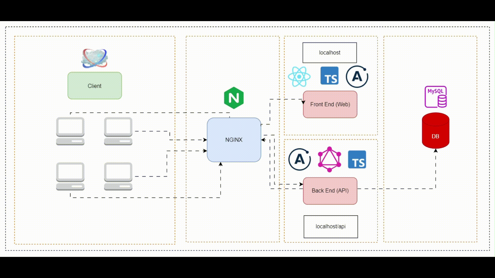
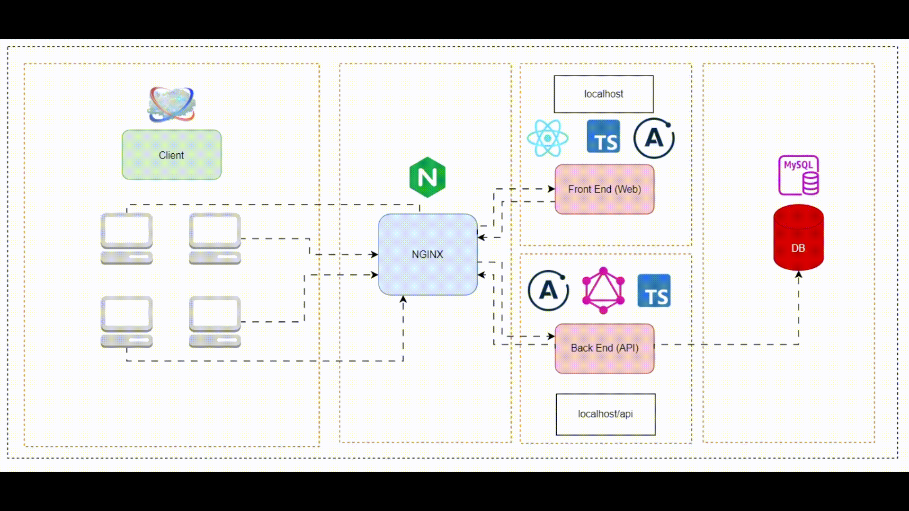

# Filtro de Alunos - Descomplica

Este sistema de filtros de Alunos é uma aplicação web desenvolvida com o intuito da completude do Teste Prático para a vaga de Desenvolvedor Júnior FullStack na Descomplica. Trata-se de uma aplicação com Front end, Back end, Banco de Dados e Proxy Reverso.

**Antes:**



**Depois:**



## Pré-requisitos

- Node.js (21.6.2)
- MySQL (8.0.3)
- Docker (4.28.0)

## Configuração

1. Clone o repositório do projeto:
   ```bash
   git clone https://https://github.com/Nawsacul/projeto-descomplica-alunos.git
   cd projeto-descomplica-alunos
   ```

2. Instale as dependências para cada pasta (api e frontend):
   ```bash
   npm install
   ```
   ou se você estiver usando yarn:
   ```bash
   yarn install
   ```

3. Configure as variáveis de ambiente:

   Renomeie o arquivo `.env.example` para `.env`
   ```bash
   cp .env.example .env
   ```

4. Configuração do banco de dados:

   Está automatizada pelo `docker-compose.yml`.

## Executando o Projeto

Instruções sobre como executar o projeto localmente.

1. Para iniciar o servidor, execute:
   ```bash
   docker-compose up --build
   ```

2. Acesse `http://localhost/` ou `http://localhost/alunos` para acesso ao front e `http://localhost/api` para acesso ao Apollo Playground.

## Testes

**OBS:**: Em face do tempo dedicado ao desenvolvimento, a busca por CPF só consegue ser concluida com sucesso caso seja digitado o cpf completo com pontuação. Ex.: "215.739.840-60", o mesmo serve para email "milena.campos@gmail.com"

Dentro da pasta `./db` é possível encontrar o arquivo `init.sql`, e lá haverão os "alunos" para teste.

Por convenção:

```js
- 'Milena Campos', '215.739.840-60', 'milena.campos@gmail.com'
- 'Vitor Teixeira', '642.813.079-31', 'vitor.teixeira@outlook.com'
- 'Luna Lima', '685.014.792-76', 'luna.lima69@yahoo.com'
- 'Maysa Cardoso', '914.708.253-41', 'maysa.cardoso@gmail.com'
- 'Joao da Rosa', '192.047.358-05', 'joao.rosa@outlook.com'
- 'Theo Gomes', '479.821.630-50', 'theo.gomes@yahoo.com'
- 'Lucca Carvalho', '489.716.025-11', 'lucca.carvalho85@dscomplica.com'
- 'Luiza Novaes', '281.736.590-95', 'luiza.novaes40@gmail.com'
- 'Augusto da Rosa', '127.389.450-23', 'augusto.rosa@hotmail.com'
- 'Sofia Lima', '546.810.297-85', 'sofia.lima@yahoo.com'
- 'Pietra Moraes', '082.974.615-30', 'pietra.moraes84@gmail.com'
- 'Isis Teixeira', '406.158.732-35', 'isis.teixeira54@descomplica.com'
- 'Julia Campos', '684.129.075-58', 'julia.campos29@descomplica.com'
- 'Henrique Correia', '718.249.563-55', 'henrique.correia69@descomplica.com'
- 'Natalia Barros', '958.712.604-11', 'natalia.barros31@gmail.com'
- 'Bruno Novaes', '130.284.765-17', 'bruno.novaes80@yahoo.com'
- 'Emanuelly Souza', '610.542.893-60', 'emanuelly.souza@outlook.com'
- 'Ana Julia Araujo', '791.560.283-77', 'ana.araujo74@mail.com'
- 'Lais Pereira', '635.271.490-07', 'lais.pereira@descomplica.com'
- 'Renan Pires', '048.762.395-92', 'renan.pires@descomplica.com'
```

## Construído Com

- [Javascript e Typescript](https://www.typescriptlang.org/)
- [React](https://reactjs.org/)
- [React Router Dom](https://reactrouter.com/en/main)
- [Node.js](https://nodejs.org/)
- [NGINX](https://docs.nginx.com/)
- [GraphQL](https://graphql.org/)
- [Apollo Server e Apollo Client](https://www.apollographql.com/docs/apollo-server/)
- [MySQL](https://www.mysql.com/)